# Like for Like Sales prediction model development
*Capstone II Project for Galvanize Data Science Immersive, Week 8*

*by Jaejun Lee*

  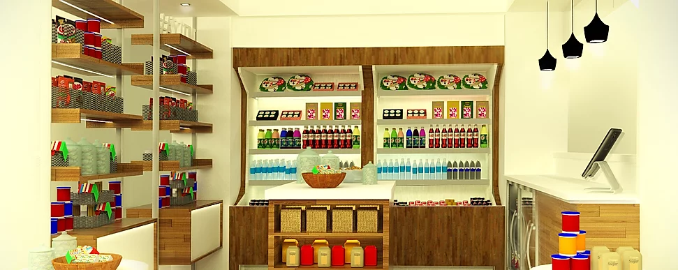

# Business Explained
Impulsify provides its solution to Retail as Secondary business such as Hotel Pantry, Gym retail section, Apartment Convenience store, etc. Those are good to have, but usually not that great in terms of management overhead and financial balance sheet. Impulsify has proven that they can improve sales and operational efficiency through sales/inventory data analytic, automated payment system and it's expertise design and setup.

# What's going on.
After all, it's getting lots of interest from prospective customers. They like to develop a model to analyze sales data from the current stores and guide the business opportunity of future stores. It will help the customer make the business decision quickly with confidence to adopt Impulsify solutions for their stores.

# Data
They provided snapshots (dump) from Postgres Database and an excel spreadsheet with aggregated sales and profit margin for each store for the year 2019. I combined them into Pandas DataFrame.
There are about 460 store observations for last year. It's a clean dataset from the established business. 

|     | property_name                                | property_code   | brand   |   num_of_rooms |   revenue |   profit_margin |   gross_profit |   id | address              | city        | state   |   zip | kind           | time_zone                  | location_type   |   flag_id | flag_name         |   brand_id | brand_name   | brand_code   | region   | hotel_size   |     spor |
|----:|:---------------------------------------------|:----------------|:--------|---------------:|----------:|----------------:|---------------:|-----:|:---------------------|:------------|:--------|------:|:---------------|:---------------------------|:----------------|----------:|:------------------|-----------:|:-------------|:-------------|:---------|:-------------|---------:|
| 122 | Hampton Inn Henderson                        | HDSNC           | Hampt   |             75 |   1107.9  |        0.552091 |        611.933 | 6951 | 385  Ruin Creek Road | Henderson   | NC      | 27536 | Select Service | Eastern Time (US & Canada) | Suburban        |        31 | Hampton Inn       |          1 | Hilton       | hampt        | S        | small        | 0.709458 |
| 228 | Hilton Garden Inn Knoxville West Cedar Bluff | TYSKH           | Hilto   |            118 |   2764.38 |        0.672252 |       1856.24  | 5941 | 216 Peregrine Way    | Knoxville   | TN      | 37922 | Select Service | Eastern Time (US & Canada) | Urban           |         1 | Hilton Garden Inn |          1 | Hilton       | hilto        | S        | medium       | 1.12513  |
| 188 | Hilton Garden Inn Columbus/Edinburgh         | CLUIN           | Hilto   |            125 |   2178.22 |        0.58644  |       1280.94  | 7099 | 12210 N Executive Dr | Edinburgh   | IN      | 46124 | Select Service | Central Time (US & Canada) | Interstate      |         1 | Hilton Garden Inn |          1 | Hilton       | hilto        | M        | medium       | 0.836908 |
| 299 | Hilton Garden Inn Washington DC Downtown     | DCACH           | Hilto   |            300 |   5391.56 |        0.688213 |       3733.33  | 6438 | 815 14th Street N.W. | Washington  | DC      | 20005 | Select Service | Eastern Time (US & Canada) | Urban           |         1 | Hilton Garden Inn |          1 | Hilton       | hilto        | N        | big          | 0.863136 |
| 453 | Tru by Hilton San Antonio Downtown           | SATDO           | Tru b   |             94 |   4412.2  |        0.578319 |       2562.1   | 6853 | 901 E. Houston St    | San Antonio | TX      | 78205 | Select Service | Central Time (US & Canada) | Urban           |       147 | Tru by Hilton     |          1 | Hilton       | tru b        | S        | small        | 2.25431  |

# Target, business performance metrics
> SPOR: Sales per Occupied Room = Monthly Revenue / (30.62 * Average Occupancy Rate)
> Profit Margin: 1 - Monthly Cost(Cost of Good Sold)/Monthly Revenue

     

          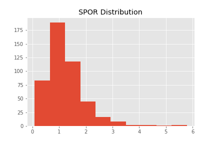
     

     

          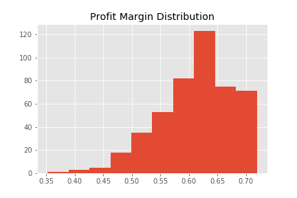
     

|    |SPOR | Profit Margin
|---    |---    |---
|Mean    |1.23  |0.61
|STD  |0.7383    |0.0647

# The current model solution in house
> Brand Code Clustering

  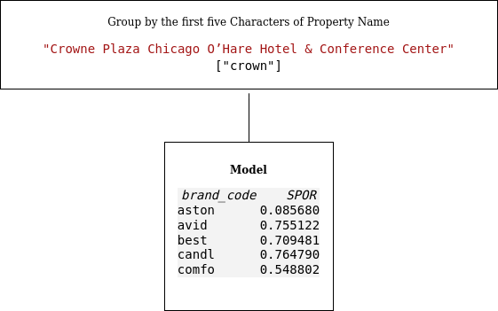

<b>INPUT to Model</b>

Hotel Name: Crowne Plaza Chicago O’Hare Hotel & Conference Center
Brand: crown
Room Count: 503
Average Occupancy: 85%
Current Average Monthly Retail Revenue: $6545.79
Current Profit Margin: 44.00%
Current Monthly Profit: $2880.15
Current SPOR: $0.50

<b>OUPUT from Model</b>
Hotel Name: crown
Brand: crown
Room Count: 293.0
Average Occupancy: 68%
Current Average Monthly Retail Revenue: $9181.66
Current Profit Margin: 61.29%
Current Monthly Profit: $5627.44
Current SPOR: $1.51

<b>Adapt the business</b> 
Hotel Name: Crowne Plaza Chicago O’Hare Hotel & Conference Center
Brand: crown
Room Count: 503
Average Occupancy: 85%
Current Average Monthly Retail Revenue: $19768.29
Current Profit Margin: 61.29%
Current Monthly Profit: $12115.98
Current SPOR: $1.51

## Analysis on brand_code

| brand_code   | # of properties |
|:-------------|----------------:|
| hilto        |             158 |
| hampt        |              78 |
| tru b        |              76 |
| homew        |              38 |
| crown        |              25 |

  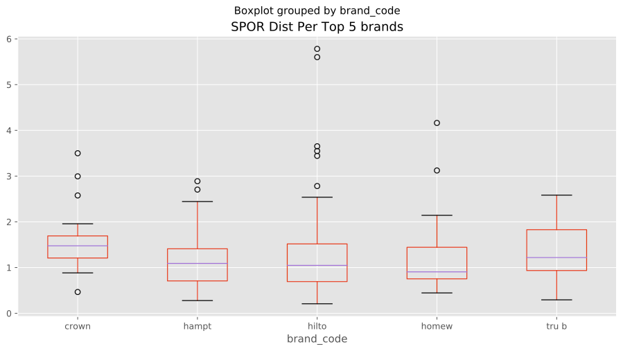

  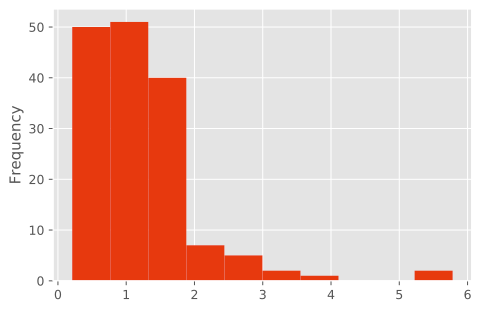

 hilton SPOR Distribution 

  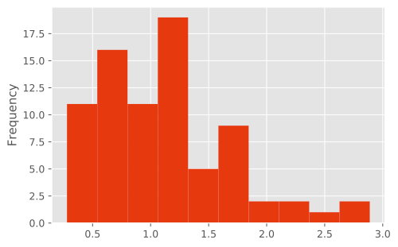

 hampt SPOR Distribution 

  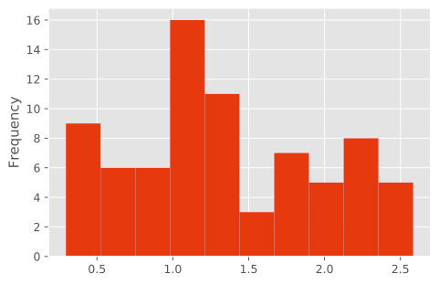

 tru b SPOR Distribution 

 brand_code is easy to interpret but, SPOR distribution within does not form a pattern for several clusters and The largest cluster, hilto, is right-skewed with a long tail. There needs to sub-cluster to improve SPOR distribution.

## Prediction Performance of brand_code

| Score Metrics   |  Score       |
|:-------------|----------------:|
| Train Data MSE  |           0.53 |
| Train Data R2      |       0.09 |
| Holdout Data MSE    |     0.48 |
| Holdout Data R2     |     -0.14 |

# Additional Features: num_of_rooms, location_type, region

## location_type

| location_type   |   ('property_code', 'count') |   ('spor', 'mean') |   ('spor', 'std') |
|:----------------|-----------------------------:|-------------------:|------------------:|
| Airport         |                           47 |            1.20918 |          0.551063 |
| Campus          |                            8 |            1.27841 |          1.12948  |
| Interstate      |                          104 |            1.05272 |          0.555151 |
| Resort          |                           13 |            1.39664 |          1.08252  |
| Suburban        |                          145 |            1.12662 |          0.563088 |
| Urban           |                          149 |            1.45476 |          0.924047 |

## region

| region   |   ('property_code', 'count') |   ('spor', 'mean') |   ('spor', 'std') |
|:---------|-----------------------------:|-------------------:|------------------:|
| C        |                           15 |          1.08526   |          0.431939 |
| M        |                           69 |          1.18953   |          0.681721 |
| N        |                           69 |          1.42968   |          1.09299  |
| O        |                            1 |          0.0856803 |        nan        |
| S        |                          215 |          1.15481   |          0.666546 |
| W        |                           97 |          1.33447   |          0.614003 |

## num_of_rooms
correlation with SPOR: 0.10 
num of rooms already applied in SPOR, but there is little bit of linearity remains. 

# KNN approch

## Choose 15 neighbors by CV

     

          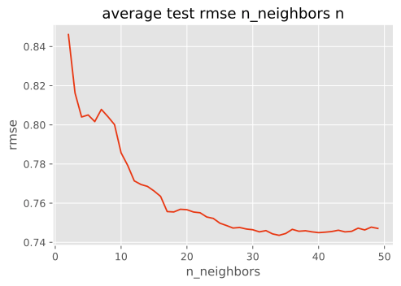
     

     

          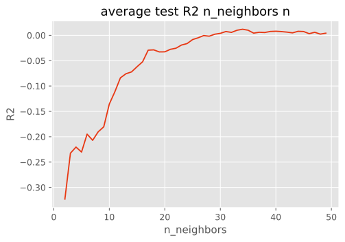
     

## by grid search for regressive elimination of feature (Step Backward), 
15 - 20 features are appropriate to improve MSE or R2 scores. However, the score does not improve from brand_code cluster method. The close neighbors seem not to share the same interests in target, SPOR. Also, the real cluster could differ dramatically because most of the brands lean toward 2 or 3 brands. location_type and region are promising, but the region's distribution is also heavily toward the south region.

With 24 features eliminated we have an MSE of 0.878 ['Crowne Plaza Hotels and Resorts' 'Doubletree by Hilton' 'Hampton Inn'\n 'Hampton Inn and Suites' 'Home2' 'Homewood Suites' 'Independent' 'room' 'Airport' 'Interstate' 'Suburban' 'Urban' 'M' 'N' 'S' 'W']

| Score Metrics   |  Score       |
|:-------------|----------------:|
| Train Data MSE  |           0.51 |
| Train Data R2      |       0.12 |
| Holdout Data MSE    |     0.47 |
| Holdout Data R2     |     -0.11 |

# XGBoost approch with grid search of model(tree, linear) and parameters to fit better in dataset.

## Parameter selected after Grid Search
clf = XGBRegressor(
        objective='reg:squarederror',
        booster = "dart",
        colsample_bylevel = 0.8, 
        colsample_bynode = 0.8,
        colsample_bytree =0.8,
        gamma = 0.5, 
        learning_rate = 0.1, 
        max_depth = 3, 
        n_estimators = 80, 
        reg_alpha = 0.3,
        reg_lambda = 0.8, 
        subsample = 0.5
    )

## Score
| Score Metrics   |  Score       |
|:-------------|----------------:|
| Train Data MSE  |           0.34 |
| Train Data R2      |       0.42 |
| Holdout Data MSE    |     0.55 |
| Holdout Data R2     |     -0.28 |

# Clustering by KPrototype

## K = 13 is best by plotting Cost function.

  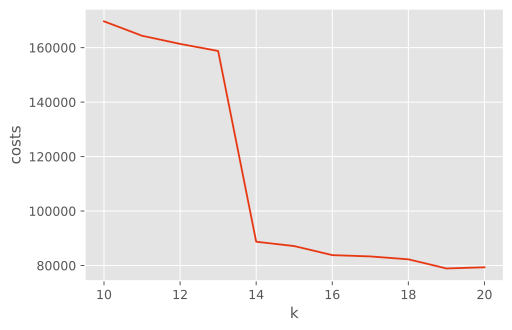

    #plot_costs(X, 10, 20)
    ### after 13, costs elbow down.
    #  [169655.69381188636,
    #  164364.36907638382,
    #  161368.5891212315,
    #  158775.1149836406, <------ k = 13
    #  88726.7001211234,
    #  87130.27749468954,
    #  83816.32073226149,
    #  83332.45085480264,
    #  82269.60881991593,
    #  78920.15376932337,
    #  79341.07766656693]

* silhouette_score could not be used. Kprototype Clustering return numerical and categorical together.

## Centeroid

|rooms | flags | region | location type|
|:-------------|----------------|----|----:|
| 151.24 | Hilton Garden Inn | W | Interstate |
| 311.81 | Crowne Plaza Hotels and Resorts | S | Urban |
| 121.38 | Hilton Garden Inn | S | Suburban |
| 825.67 | Holiday Inn Express | S | Campus |
| 92.49 | Tru by Hilton | S | Suburban |
| 423.33 | Crowne Plaza Hotels and Resorts | N | Urban |
| 216.44 | Doubletree by Hilton | W | Urban |
| 105.12 | Hilton Garden Inn | S | Suburban |
| 245.11 | Embassy Suites | S | Urban |
| 197.76 | Crowne Plaza Hotels and Resorts | S | Urban |
| 172.96 | Hilton Garden Inn | S | Urban |
| 75.26 | Hampton Inn | S | Interstate |
| 135.54 | Hilton Garden Inn | S | Urban |

## Convert Clustering as prediction model. mean of spors in each cluster. Score....

| Score Metrics   |  Score       |
|:-------------|----------------:|
| Train Data MSE  |           0.55 |
| Train Data R2      |       0.06 |
| Holdout Data MSE    |     0.41 |
| Holdout Data R2     |     0.04 |

## Use case

### INPUT
x = [[503, 'Crowne Plaza Hotels and Resorts', 'M', 'Airport']]

### OUTPUT
>cluster 5

>SPOR: 1.71

>Profit Margin: 0.64

### list of comparable store properties

|    | property_name                             | property_code   | brand   |   num_of_rooms |   revenue |   profit_margin |   gross_profit |   id | address                    | city      | state   |   zip | kind           | time_zone                   | location_type   |   flag_id | flag_name                       |   brand_id | brand_name   | brand_code   | region   | hotel_size   |     spor |   cluster |
|---:|:------------------------------------------|:----------------|:--------|---------------:|----------:|----------------:|---------------:|-----:|:---------------------------|:----------|:--------|------:|:---------------|:----------------------------|:----------------|----------:|:--------------------------------|-----------:|:-------------|:-------------|:---------|:-------------|---------:|----------:|
| 13 | Crowne Plaza Atlanta Airport              | IHG-ATLAT       | Crown   |            378 |  12116    |        0.658382 |        7974.02 | 6745 | 1325 Virginia Avenue       | Atlanta   | GA      | 30344 | Full Service   | Eastern Time (US & Canada)  | Airport         |       131 | Crowne Plaza Hotels and Resorts |         21 | IHG          | crown        | S        | big          | 1.5394   |         5 |
| 14 | Crowne Plaza Atlanta Perimeter at Ravinia | IHG-ATLCP       | Crown   |            495 |  15513.1  |        0.589848 |        9161.73 | 6887 | 4355 Ashford Dunwoody Road | Atlanta   | GA      | 30346 | Full Service   | Eastern Time (US & Canada)  | Urban           |       131 | Crowne Plaza Hotels and Resorts |         21 | IHG          | crown        | S        | mega         | 1.50515  |         5 |
| 15 | Crowne Plaza Baltimore                    | IHG-BALWB       | Crown   |            385 |   3738.35 |        0.668021 |        2466.83 | 6841 | 110 West Baltimore Street  | Baltimore | MD      | 21201 | Full Service   | Eastern Time (US & Canada)  | Urban           |       131 | Crowne Plaza Hotels and Resorts |         21 | IHG          | crown        | N        | big          | 0.466343 |         5 |
| 18 | Crowne Plaza Columbus-Downtown            | IHG - CMHOC     | Crown   |            419 |  10984    |        0.638367 |        7021.97 | 7053 | 33 East Nationwide Blvd    | Columbus  | OH      | 43215 | Full Service   | Central Time (US & Canada)  | Urban           |       131 | Crowne Plaza Hotels and Resorts |         21 | IHG          | crown        | M        | big          | 1.25901  |         5 |
| 19 | Crowne Plaza Downtown Denver              | IHG-DENDT       | Crown   |            380 |  20393.9  |        0.619366 |       12637    | 6758 | 1450 Glenarm Place         | Denver    | CO      | 80202 | Select Service | Mountain Time (US & Canada) | Urban           |       131 | Crowne Plaza Hotels and Resorts |         21 | IHG          | crown        | W        | big          | 2.57752  |         5 |
